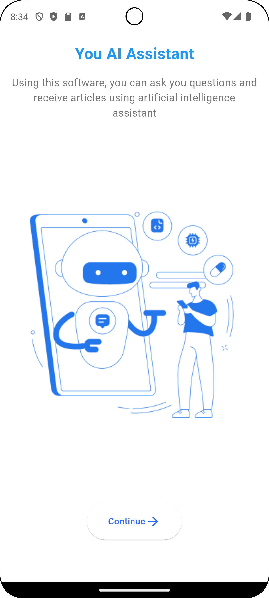
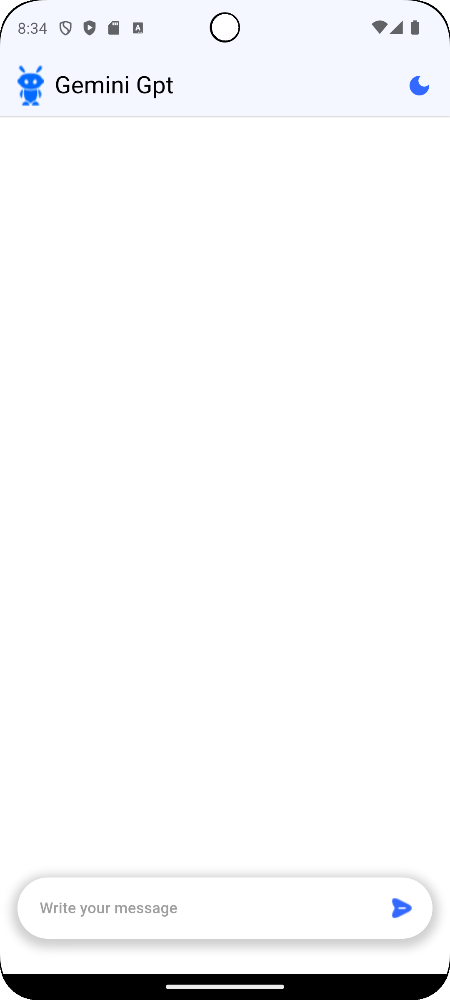
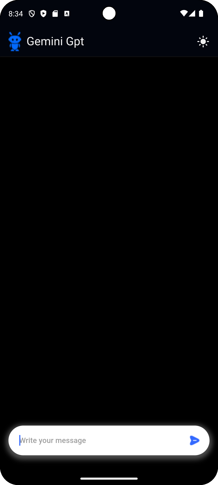
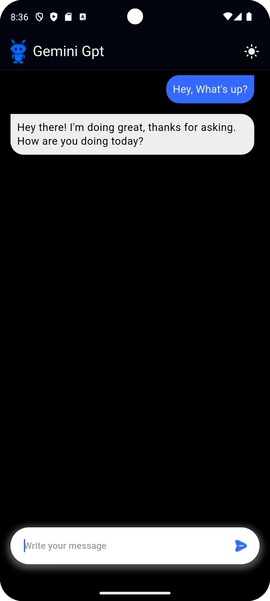

# Gemini Chat  

Gemini Chat is a smart, real-time chat app powered by **Google Gemini AI**. Built using the **ChatGPT Chat Bot App UI** from Figma Community, it features **Riverpod** for efficient state management.

## Features

- **Real-time AI Chat**: Engage in dynamic and responsive conversations with Gemini AI, tailored to your input.  
- **API Key Management**: Ensures secure handling of API keys using a `.env` file for robust security and privacy.

## Screenshots  

  
  
  
  

